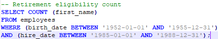
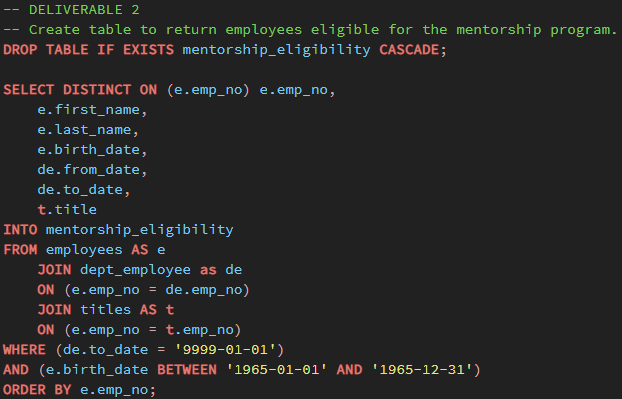

# PostgresSQL Analysis: Retiring Employees

## Purpose and Background

The purpose of this analysis was to find how many employees are going to be retiring soon from a given dataset. I needed to find who will be retiring and how many openings will be available when these workers do retire. I was able to find answers to these questions through creating a SQL database consisting of a connected web of several different tables of information about the employees.

Out of the employees who are getting ready to retire, I was also tasked with:
1. finding how many employees are only in the __Sales__ and __Development__ departments, and
2. finding out how many in total would be __eligible for an employee mentorship program__ that was going to be introduced - for those who would like to, employees could take on a mentor role part-time to those who may be filling their role in the company, instead of completely retiring.

## Results

For reference: employees who are getting ready to retire are counted as:
- those who were born between 1952-01-01 and 1955-12-31,
- who were hired between 1985-01-01 and 1988-12-31,
- current employees (a "to_date" of 9999-01-01).

and those who were eligible for the program were counted as:
- those born between 1965-01-01 and 1965-12-13,
- current employees (a "to_date" of 9999-01-01).

I was working with lists of the complete history of employees and ex-employees, meaning those who were no longer with the company anymore, so those people had to be filtered out. In finding these numbers, I also only counted the latest title of the employees if they held more than one at any point in time. 

The results of the analysis show that out of 240,124 total current employees, there are __41,380 employees that will be retiring soon__, and that there are __1,549 employees who are eligible for the mentorship program__. This means a few things:
- there is a high number of employees retiring at once (over 17.2% of the total current workforce!),
- there will be many spots open that need to be filled,
- there is a low number of employees that are eligible for the mentorship program (3.7% of those getting ready to retire), and
- there is a relatively high percentage of employees from the Sales and Development departments that are retiring (36.6%).

## Summary

There are two questions that naturally arise when looking at the analysis:
1. _How many roles will need to be filled as the "silver tsunami" begins to make it impact?_
    - There are 41,380 roles that will need to be filled. This info comes from our `retirement_info` table that we created. It contains the employee number, first name, and last name of all of the employees that will be retiring soon. The query to filter the data for this table can be found in the image below:
    
    
    
    This returns a table of 41,380 currently employed people who are eligible for retirement.
    
2. _Are there enough qualified, retirement-ready employees in the departments to mentor the next generation of employees?_
    - There are not enough qualified employees in the departments to mentor the next generation of employees who will take the place of everyone who will retire. There are only 1,549 employees who are eligible for the mentorship program. That is only 3.7% of the number of employees who are getting ready to retire. There will still be 39,831 positions available - that is far too much for those in the mentorship program to handle alone! In the bottom left hand corner of the first image below, we can see that there are only a total of 1,549 entries in our `mentorship_eligible` table. The table consists of the `employee number`, `first and last names`, and `birth dates` from the `employees` table, the `from and to dates` from the `dept_employee` table, and the `title` from the `titles` table. An inner join was done on the `employees` and `dept_employee` tables, and then another inner join was done on the `dept_employee` and `titles` table to get the necessary information. Filters on the to date on the birthdate were done so that only current employees would be returned.
    
    
    
    

## Concerns and difficulties

I questioned whether or not some of the tables that I created in the past were correct. It seems like there are two different counts for the amount of people that are retiring: when taking a look at the `retiring_titles_count` table, I can see that there are a total of 72,458 entries compared to the 41,380 count that I took from the `retirement_info` table that we created.

Then from the `current_emp` table, there are only 33,118 entries - this count should not be lower than the number of employees that are retiring.
